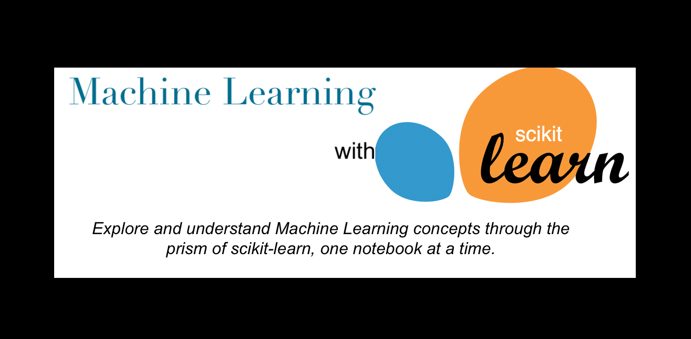

# Machine Learning with scikit-learn

This course is derived from the [June 2022](https://github.com/INRIA/scikit-learn-mooc/pull/634/commits/18e880b6b588254f04a5d869fe9836943885d67f) version of the brilliant work created by [INRIA](https://github.com/INRIA/scikit-learn-mooc)

 

We modified the [reference content](https://github.com/INRIA/scikit-learn-mooc) to suit the requirement of our team, where we conducted one training session per week and thus created a single self-contained notebook for respective machine learning/scikit-learn topic. These weekly training sessions ranged from 1 hour to 3 hours, and thus one can follow all the notebooks in roughly 10-18 hours, depending on their level of expertise. 

 

**We highly recommend enrolling in the original [Machine learning in Python with scikit-learn MOOC](https://www.fun-mooc.fr/en/courses/machine-learning-python-scikit-learn)**

 

*Importantly, **we don't claim any copyrights on this material** derived from the [original work]((https://github.com/INRIA/scikit-learn-mooc)) and have included references to all the other sources wherever used.*

 

*Credits, if any, rightly goes to [Inria Learning Lab](https://learninglab.inria.fr/), [scikit-learn @ La Fondation Inria](https://scikit-learn.fondation-inria.fr/) and [Inria Academy](https://www.inria-academy.fr/formation/scikit-learn-la-boite-a-outils-de-lapprentissage-automatique/)*

 

## How to setup/run and other notes on your local machine

1. Install conda and run  `conda env create -f environment.yml`
3. This will create  `ml_with_sk` environment required to run the python notebooks available in the `notebooks` folder
4. `solutions` folder contains the answers to the quiz questions
5. `figures` folder contains the figures used in notebooks
6. `datasets` contains the datasets used in notebooks

 

 

